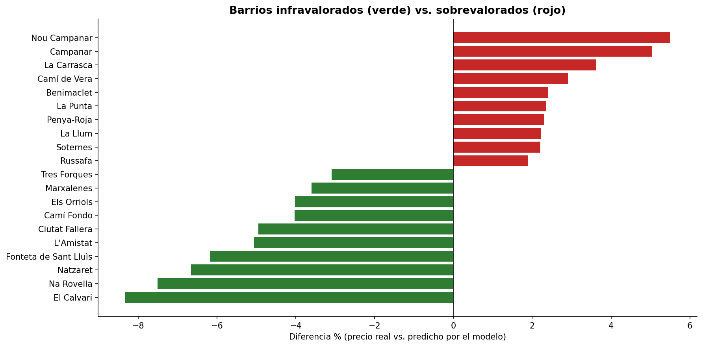
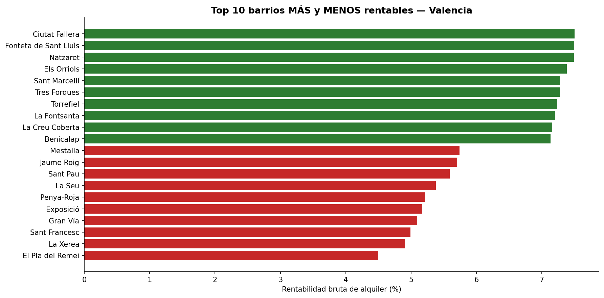
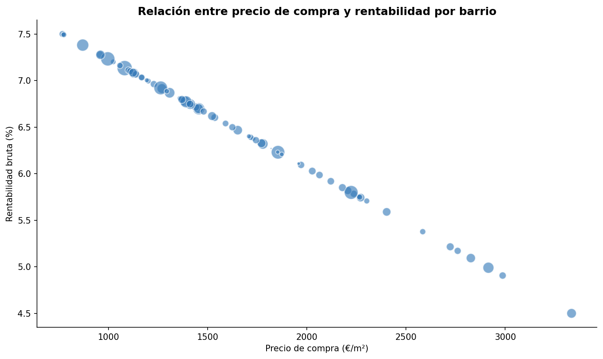

# 🏠 Mapa de Inversión Inmobiliaria de Valencia

**¿Qué barrios de Valencia ofrecen la mejor rentabilidad de alquiler, y cuáles están sobrevalorados?**

Análisis de inversión inmobiliaria sobre 33.622 viviendas reales en venta en Valencia (2018), con detección de barrios sobre/infravalorados mediante Machine Learning y un mapa interactivo de rentabilidad por barrio.

🗺️ **[Ver el mapa interactivo en vivo](https://lucasees.github.io/proyecto5-inmobiliario-valencia/mapa_rentabilidad_valencia_v2.html)**

---

## 📊 El hallazgo principal: detección de sobrevaloración

Usando un modelo de Machine Learning (LightGBM) entrenado sobre las características objetivas de cada vivienda (superficie, habitaciones, baños, distancia al centro, distancia al metro, antigüedad), se predijo el precio esperado de cada vivienda y se comparó contra el precio real. La diferencia revela qué barrios cobran más (o menos) de lo que sus características objetivas justifican.



**Barrios más sobrevalorados:** Nou Campanar (+5,5%), Campanar (+5,0%), La Carrasca (+3,6%) — el precio real supera lo que el modelo predice según sus características.

**Barrios más infravalorados (oportunidades):** El Calvari (-8,3%), Na Rovella (-7,5%), Natzaret (-6,7%) — el precio real está por debajo de lo esperado.

> Este resultado proviene 100% de datos reales: 33.622 anuncios con coordenadas GPS exactas, validados con un modelo de regresión (MAE 244 €/m², error relativo 14,3%).

---

## 💰 Rentabilidad de alquiler por barrio



**Más rentables:** Ciutat Fallera (7,50%), Fonteta de Sant Lluís (7,49%), Natzaret (7,49%) — barrios periféricos y económicos.

**Menos rentables:** El Pla del Remei (4,50%), La Xerea (4,91%), Sant Francesc (4,99%) — los barrios más prestigiosos y caros de Valencia, paradójicamente, ofrecen el peor retorno relativo por alquiler.

**Cruce de hallazgos:** Natzaret y Ciutat Fallera aparecen simultáneamente en el top de mayor rentabilidad de alquiler Y en el top de barrios infravalorados — la combinación ideal para un inversor: comprás por debajo de lo esperado y además alquilás con buen retorno.

### ⚠️ Nota metodológica honesta sobre el alquiler

El precio de compra usado en este proyecto es **dato real** (33.622 anuncios de Idealista, dataset académico [`idealista18`](https://github.com/paezha/idealista18)). El portal oficial de datos abiertos del Ayuntamiento de Valencia, que publica precios de alquiler por barrio, no estuvo accesible durante este análisis.

Ante esa limitación, el alquiler se **estimó** aplicando el yield (rentabilidad) medio documentado para Valencia (~5,9% anual, fuentes públicas del sector inmobiliario), ajustado linealmente según el patrón de mercado conocido: los barrios más caros en compra tienden a tener yields más bajos, y los más económicos, yields más altos. El gráfico siguiente muestra esa relación:



**Esta curva no es un hallazgo de los datos — es la fórmula de estimación aplicada.** Se incluye por transparencia metodológica, no como resultado de análisis. El ranking de rentabilidad (gráfico anterior) debe leerse con esa salvedad: el patrón direccional es consistente con la literatura del sector, pero el valor exacto de cada barrio es una estimación, no una observación directa del mercado de alquiler.

---

## 🗺️ El mapa interactivo

Mapa de calor de los 73 barrios de Valencia, coloreados por rentabilidad estimada (rojo = baja, verde = alta), con tooltips que muestran precio de compra, rentabilidad y nivel de sobre/infravaloración de cada barrio.

👉 **[Abrir el mapa interactivo](https://lucasees.github.io/proyecto5-inmobiliario-valencia/mapa_rentabilidad_valencia_v2.html)**

---

## 🔧 Metodología y stack técnico

| Fase | Herramienta | Qué se hizo |
|---|---|---|
| Datos | `idealista18` (R package, convertido a CSV) | 33.622 viviendas reales con coordenadas GPS, 2018 |
| Geolocalización | `geopandas`, `shapely` | Spatial join: asignación de cada vivienda a su barrio (99,9% de éxito) |
| Análisis | `pandas`, `numpy` | Cálculo de precio mediano, rentabilidad y yield por barrio |
| Modelo ML | `LightGBM`, `scikit-learn` | Predicción de precio esperado y detección de sobre/infravaloración |
| Visualización | `matplotlib`, `seaborn` | Gráficos estáticos de hallazgos |
| Mapa | `folium` | Mapa de calor interactivo (choropleth) con tooltips |
| Publicación | GitHub Pages | Hosting del mapa interactivo |

**Próxima fase:** dashboard ejecutivo en Power BI para presentación a inmobiliarias.

---

## 📁 Estructura del repositorio

```
proyecto5_inmobiliario_valencia.ipynb   → Notebook completo con todo el análisis
grafico1_rentabilidad_barrios.png       → Ranking de rentabilidad por barrio
grafico2_precio_vs_rentabilidad.png     → Relación precio-rentabilidad (nota metodológica)
grafico3_overvaluation.png              → Sobre/infravaloración (modelo ML)
mapa_rentabilidad_valencia_v2.html      → Mapa interactivo (también vía GitHub Pages)
```

---

**Autor:** Lucas Espinosa — [LinkedIn](https://linkedin.com/in/lucasespinosaa) · [GitHub](https://github.com/lucasees)

**Fuente de datos:** Rey-Blanco, D. et al. (2024). *A geo-referenced micro-data set of real estate listings for Spain's three largest cities*. Environment and Planning B. [DOI: 10.1177/23998083241242844](https://doi.org/10.1177/23998083241242844)
